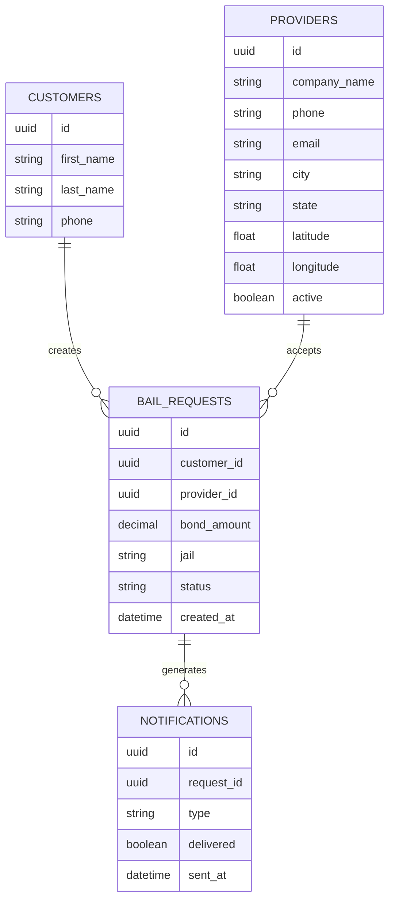

# BailMate Database Schema

This diagram illustrates the core database relationships.

## Tables

### Customers
Stores customer information requesting bail assistance.

### Providers
Licensed bail bond companies available within the marketplace.

### Bail Requests
Tracks every request submitted through the application.

### Notifications
Tracks SMS and Push Notification delivery.