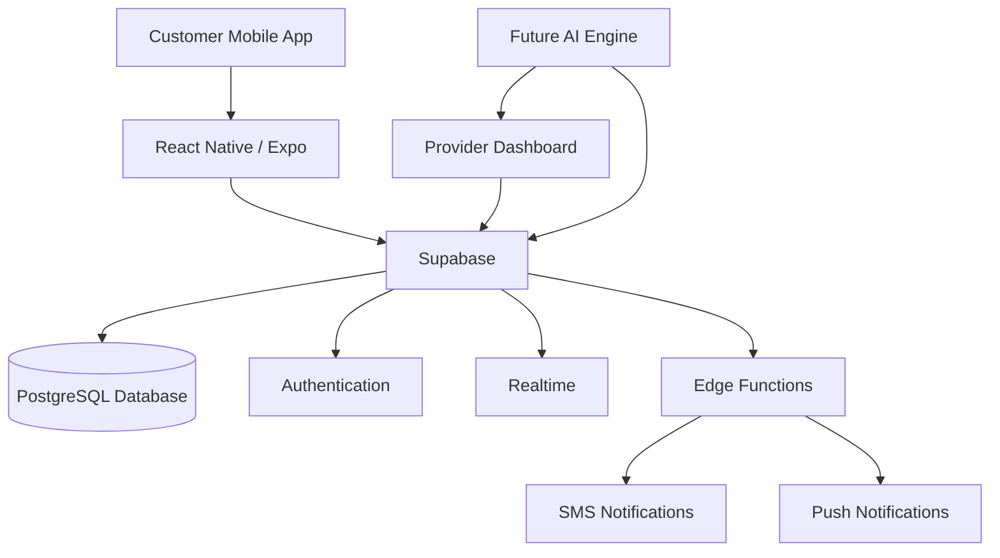

# BailMate System Architecture

This diagram illustrates the high-level architecture of BailMate.

## Components

### Mobile Application
- React Native
- Expo Router
- TypeScript

### Backend
- Supabase
- PostgreSQL
- Edge Functions

### Communication
- SMS Notifications
- Push Notifications

### Future AI Layer
- Provider Ranking
- Intelligent Dispatch
- Fraud Detection
- Predictive Analytics